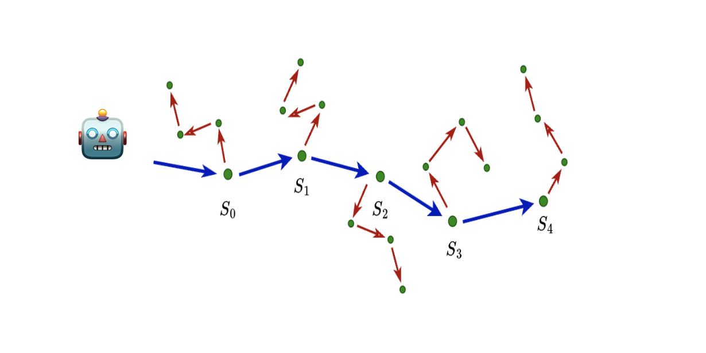
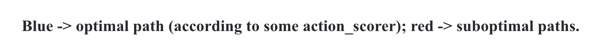
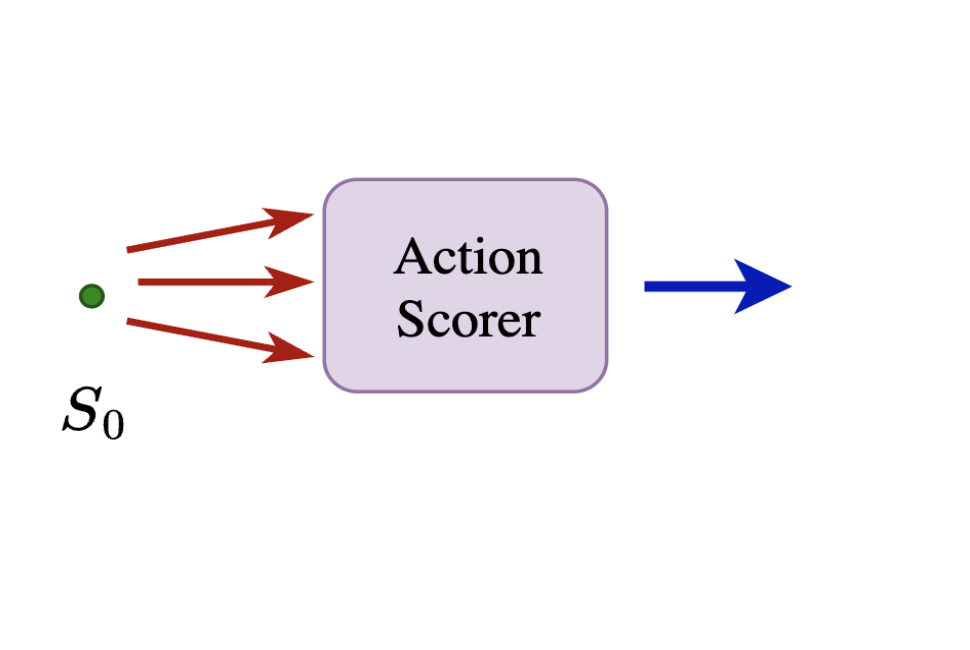
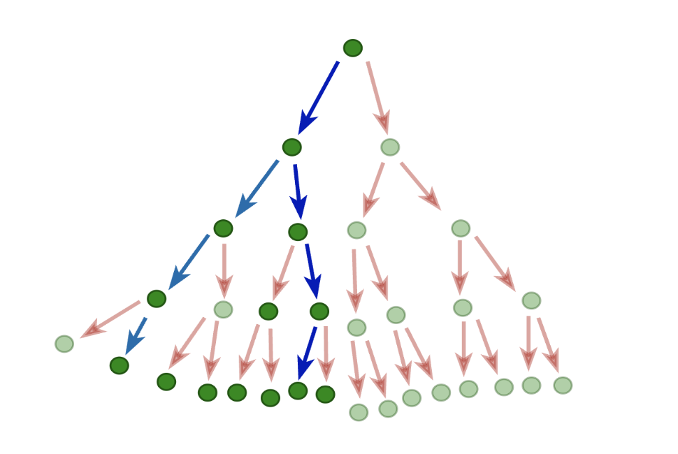
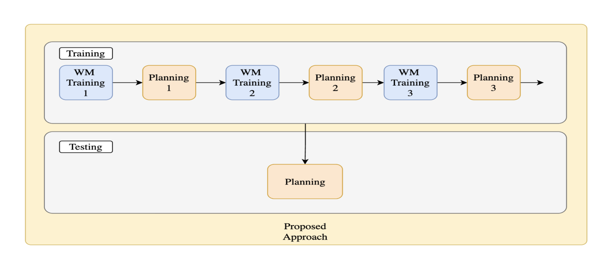

# Deep Decision Making and Reinforcement Learning: Final Project Submission

## Team Members  

  <strong>Jayesh Chaudhari</strong> &nbsp;&nbsp;&nbsp;&nbsp;
  <strong>Satyam Kumar</strong> &nbsp;&nbsp;&nbsp;&nbsp;
  <strong>Varad Vijay Suryavanshi</strong> &nbsp;&nbsp;&nbsp;&nbsp;
  <strong>Rivujit Das</strong>

  jsc9903@nyu.edu &nbsp;&nbsp;&nbsp;&nbsp;
  sk12075@nyu.edu &nbsp;&nbsp;&nbsp;&nbsp;
  vs3273@nyu.edu &nbsp;&nbsp;&nbsp;&nbsp;
  rd3681@nyu.edu

## Title  
**Improving World Model Robustness in DreamerV3 Using Mixed Policy Sampling**

## Contents
- [1. Introduction](#1-introduction)
- [2. Motivation for the Change](#2-motivation-for-the-change)
- [3. Proposed Modification: Mixed Policy Sampling](#3-proposed-modification-mixed-policy-sampling)
- [4. Technical Implementation](#4-technical-implementation)
- [5. Effects on Training Dynamics](#5-effects-on-training-dynamics)
- [6. Assumptions and Constraints](#6-assumptions-and-constraints)
- [7. Conclusion](#7-conclusion)

## 1. Introduction

Reinforcement learning (RL) has demonstrated significant advancements across a diverse range of domains, from strategic board games to sophisticated robotic control tasks. Nevertheless, purely model-free RL approaches typically demand extensive interaction data, face considerable challenges in dealing with environments with sparse or long-horizon rewards, and necessitate substantial hyperparameter tuning and retraining for each new task even within the same domain.

To mitigate these limitations, world models have emerged as an effective paradigm. A world model learns an internal representation of environmental dynamics, enabling agents to anticipate the future states resulting from a sequence of actions. Such models provide the capability for the agent to internally simulate or "imagine" future scenarios, significantly reducing reliance on inefficient trial-and-error interactions with the real environment.

Historically, many world models have operated directly within pixel-space, reconstructing raw images to predict future observations. However, this approach incurs substantial computational costs due to intensive image reconstruction requirements and frequently relies on complex diffusion-based models. Consequently, recent research has increasingly favored latent-space prediction, wherein models operate on compressed, low-dimensional representations of environmental states.

DreamerV3 is a state-of-the-art model-based reinforcement learning (MBRL) algorithm that enables agents to plan and learn from imagined experiences. It leverages a world model to simulate future trajectories, thus significantly improving sample efficiency. At its core, DreamerV3 uses a policy network (an `MLPHead`) that outputs a probability distribution over actions, and typically selects actions with higher probabilities during training and interaction.

However, this behavior leads the agent to primarily visit trajectories deemed optimal or high-reward according to the current state of the policy. As a result, suboptimal, rare, or "bad" states might never be explored. This lack of diversity in the training data can cause the world model to generalize poorly, especially in complex environments with deceptive rewards or partial observability.

## 2. Proposed Methodology

We try to work on these two recent methods and try to solve the issues in these methods. DINO-WM assumes having access to offline datasets with sufficient state-action coverage, which can be challenging to obtain for highly complex environments, and it also not the approach that humans would generally take while performing a task if you are play a game you would just know the basic rules or maybe not even that and start playing by taking random actions and making your understanding of the games dynamics better overtime. So we try to collect data using various exploration strategies. This data is mixed with optimal paths (reward maximizing actions) and suboptimal paths (for exploration) and trained on WM. These explorations strategies will involve maximising reward and reward would be of different types and would vary across environments. 

Our data collection would look like following:
- Start from state S_0
- Say n possible actions, use action_scorer to get optimal action, take the best exploratory action based  on the exploration reward aside from the optimal action
- Build a short suboptimal exploratory path
- Train WM on both optimal path and suboptimal paths

### 2.1 Actions Scorer

The reward strategies can be broadly categorized into extrinsic, intrinsic, hybrid, and hierarchical rewards. In our case the intrinsic reward strategies seem to be relevant so we try to work on them. We implement exploration/curiosity based reward strategies. Examples of these strategies in the pushT environment can be increasing the number of collisions between the pusher robotic arm and the T block, increasing pixel to pixel change in the environment per step.

  

  

  

  

In addition to global exploration strategies, we adopt a local exploration approach to effectively train and refine our world model. Specifically, starting from an identified optimal trajectory (represented by the dark blue line), we systematically explore additional nearby states within a defined local window. This local exploration involves investigating multiple alternative paths branching off from the current optimal trajectory.
Within this local exploration window, we calculate and evaluate rewards for all potential state-action pairs explored. Importantly, if any of these alternative paths within the local window yield a higher reward compared to the previously identified optimal path, the superior alternative path (represented by the light blue line) replaces the current optimal trajectory, becoming the new focus for exploration. This dynamic updating ensures continuous refinement and adaptation of the optimal path based on the most rewarding outcomes discovered through local exploration.
These locally explored suboptimal paths also provide diverse and valuable training data, enriching the world model's understanding by covering a broader range of environmental dynamics. This comprehensive exploration methodology enhances the predictive capability of our world model, significantly increasing policy robustness and adaptability to diverse and unforeseen environmental conditions.

  

  

### 2.2 Ideal WM
The current approach in DINO-WM involves training the world model followed by planning, our proposed methodology integrates these stages into an iterative cycle. Initially, we perform an initial phase of world model training using exploration-derived data. Once the world model has acquired foundational dynamics knowledge, we proceed to a planning stage where optimized actions are computed. These optimized actions, derived from planning, are then incorporated back into further training of the world model, enriching its predictive capabilities and aligning its understanding closely with optimal decision-making patterns.

This iterative cycle consisting of alternating training and planning phases is repeated multiple times. Each iteration progressively refines the world model by continually incorporating the latest optimal actions identified during planning. This continuous feedback loop between planning and training ensures that the world model dynamically improves, effectively integrating strategic insights from planning into its predictive structure.

  

  <strong>Figure 4: Existing Architecture</strong>

  

<em>Figure 5: Proposed Architecture</em>

### 2.3 Inducing Exploration in Dreamer-V3

To test our hypothesis on Dreamer-V3, we modify the agent's policy method such that during environment interaction, the batch of actions is composed of both policy-driven and randomly sampled actions. The implementation details are as follows:

- **Batch Size**: We configure the system to use a batch size of 20 parallel environment instances.
- **Policy Sampling**: For the first 16 environments (instances 0 to 15), actions are sampled from the learned policy distribution, preserving the original behavior of DreamerV3.
- **Random Sampling**: For the remaining 4 environments (instances 16 to 19), actions are uniformly sampled from the full discrete action space (`0` to `17`, inclusive, for Atari).

This ensures that in each training step, 80% of actions reflect learned behavior, while 20% inject purely exploratory behavior.

## 3. Results

## 4. Results and Discussion

## 5. Effects on Training Dynamics

This mixed sampling strategy influences the DreamerV3 learning process in two key ways:

1. **Improved World Model Coverage**: Suboptimal and "bad" states, introduced via random actions, enhance the diversity of the replay buffer. The world model learns to simulate a broader and more accurate range of environment dynamics.

2. **Robust Policy Learning**: Since DreamerV3 uses the final `k` steps from real trajectories to seed imagination rollouts, the inclusion of difficult or novel states forces the policy to learn strategies for recovery and generalization.

## 6. Conclusion

We introduce a lightweight yet impactful modification to the DreamerV3 framework to promote better exploration and robustness. By injecting randomly sampled actions into a portion of the interaction batch, we encourage the agent to visit diverse states, making both the world model and policy more capable of handling suboptimal and unexpected situations. This strategy preserves the core structure of DreamerV3 while addressing one of its key limitations in exploration and generalization.

This mixed-policy sampling technique offers a promising direction for enhancing MBRL agents, particularly in environments where optimal trajectories are hard to discover without structured exploration.

## 7. Future Directions
